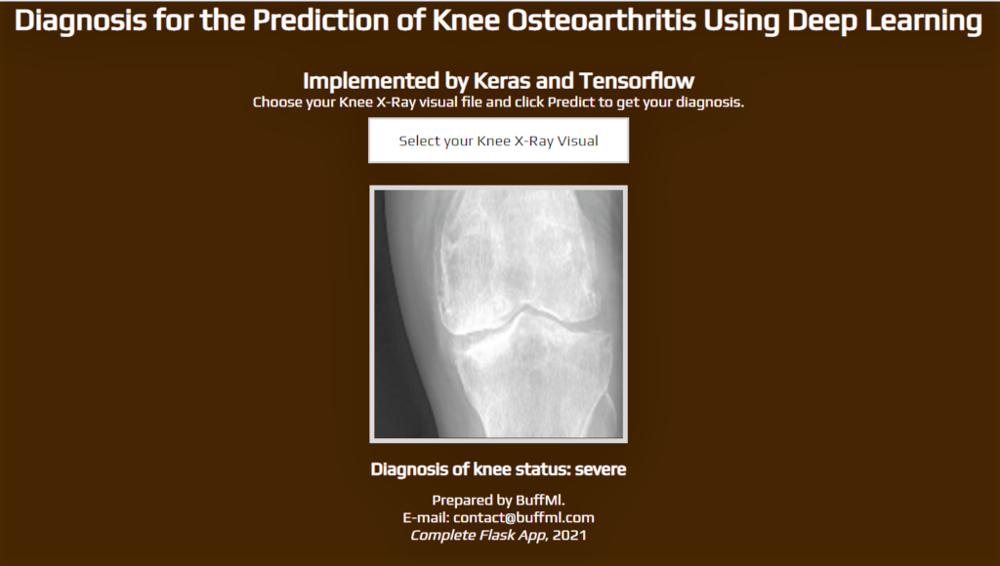

# Knee-Osteoarthritis Classification using Deep Learning

## Web-based Flask application

Diagnosis for the prediction of knee osteoarthritis using deep learning techniques.

The target is to evaluate the performance of the deep learning algorithm to predict per Kellgren and Lawrence grades. The Kellgren and Lawrence classification system: grade 0 (normal): definite absence of x-ray changes of osteoarthritis grade 1 (doubtful): doubtful joint space narrowing and possible osteophytic lipping grade 2 (mid): definite osteophytes and possible joint space narrowing grade 3 (moderate): moderate multiple osteophytes, definite narrowing of joint space and some sclerosis and possible deformity of bone ends grade 4 (severe): large osteophytes, marked narrowing of joint space, severe sclerosis and definite deformity of the bone end. 

Dataset Link: https://data.mendeley.com/datasets/t9ndx37v5h/1
